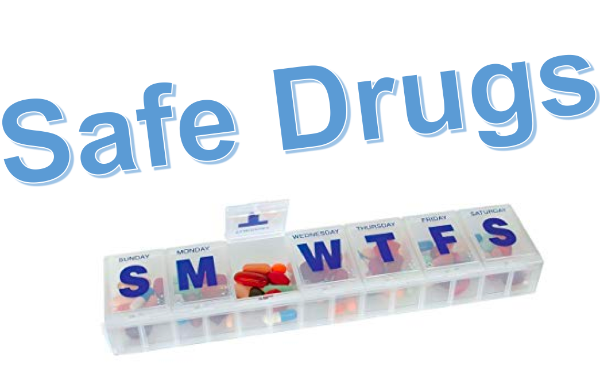

</img>

## <p align="center"> A framework for interacting with drug safety data </p> 

* [Quickstart](https://github.com/NCBI-Hackathons/SafeDrugs/blob/master/sandbox/feature_drugs_and_outcomes.ipynb)

### Table of contents
* [Goal](#goal)
* [Installation](#installation)
* [Introduction](#introduction)
* [Use Cases](#use-cases)
* [Resources](#resources)

### Goal <a name="goal"></a>

- Using a standardized dataset of adverse drug reactions from the FDA (AEOLUS, see resources for link to paper), provide a web app for interacting and visualizing with this unique data source. 

### Installation <a name="installation"></a>

```
git clone git@github.com:NCBI-Hackathons/SafeDrugs.git <br />
cd path/to/SafeDrug/directory <br />
pip install -r requirements.txt <br />
```

### Introduction <a name="introduction"></a>

- See introduction in app

- There has been a lot of development by the FDA in providing tools and apps using their API to query their ADR data. 

- As is, the FDA data is not standardized and so contains redundancy and ambiguity in their data (e.g. aspirin and aspirin 81mg). Using a standardized version of their data can provide additional clarity representing ADR data. Our app would be another community tool to possibly add to their online portfolio (see OpenFDA community tools). 

### Use cases <a name="use-cases"></a>

* [Data visualization](https://linktojupyternotebook)
* [Data analysis](https://linktojupyternotebook)
* [Web app](https://linktoDashwebapp)

### Resources <a name="resources"></a>

Plotly/dash github repository

- https://github.com/plotly/dash

Dash User Guide

- https://dash.plot.ly/

OpenFDA

- https://open.fda.gov/

OpenFDA contact for submitting tool

- open@fda.hhs.gov

OpenFDA tools (using API)

- https://open.fda.gov/tools/

OpenFDA Community Apps

- https://open.fda.gov/community/

AEOLUS paper

- https://www.nature.com/articles/sdata201626

Unified Medical Language System Quick Start Guide

- https://www.nlm.nih.gov/research/umls/quickstart.html
